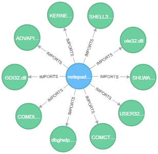

# import_vis
A fairly hacky tool to visualise and query imports and exports in PE files. Walks a provided directory path to fine PE files, pulls out imports and exports and loads them into Neo4j for querying.

## Usage
### Setup
```pip install -r requirements.txt```
### Help
```
python import_vis.py --help
usage: import_vis.py [-h] --root path [--username username]
                     [--password password] [--address address]

Loads imports and exports from PE files in a given directory into Neo4j for
querying and analysis.

optional arguments:
  -h, --help            show this help message and exit
  --root path, -r path  Folder to index DLL's from
  --username username, -u username
                        Neo4j username
  --password password, -p password
                        Neo4j password
  --address address, -a address
                        URL and port for connecting to Neo4j
```
## Examples
Running against Notepad++:   
```
python import_vis.py -r "C:\Program Files (x86)\Notepad++" -u neo4j -p neo4j -a bolt://localhost:7687
```
Retrive all nodes using Cypher:   
```
MATCH (n) RETURN n
```
Gives a graph that looks like:    
   
Retrieve all imports from 'notepad++.exe':   
```
MATCH (n) WHERE n.name = 'notepad++.exe' RETURN (n)-[]->()
```
Returns:   
    
Find all files which import a function named 'CreateDirectoryW':    
```
MATCH p=(()-[i:IMPORTS]->()) WHERE 'CreateDirectoryW' in i.functions RETURN p
```
For notepad++ returned:   
   